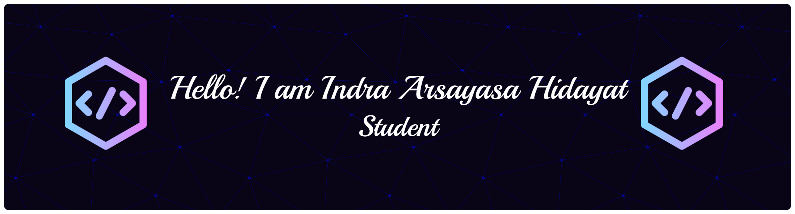

## Hi,welcome to my profile👋

---

Welcome to my GitHub profile! I am still a student who is learning about the world of coding.

---

<!--
**Arsayasa/Arsayasa** is a ✨ _special_ ✨ repository because its `README.md` (this file) appears on your GitHub profile.
Here are some ideas to get you started:

- 🔭 I’m currently working on ...
- 🌱 I’m currently learning ...
- 👯 I’m looking to collaborate on ...
- 🤔 I’m looking for help with ...
- 💬 Ask me about ...
- 📫 How to reach me: ...
- 😄 Pronouns: ...
- ⚡ Fun fact: ...
-->

🌱 I’m currently learning

  
  
  
  
  

---

#### 🎵 My Song Favorite

---

#### 📊 GitHub Stats:

 
 

#### 🏆 GitHub Trophies

#### 🔝 Top Contributed Repo

---

<!-- Proudly created with GPRM ( https://gprm.itsvg.in ) -->

#### 🎮 Play Game With Me

<picture>
  <source media="(prefers-color-scheme: dark)" srcset="https://raw.githubusercontent.com/Arsayasa/Arsayasa/output/pacman-contribution-graph-dark.svg">
  <source media="(prefers-color-scheme: light)" srcset="https://raw.githubusercontent.com/Arsayasa/Arsayasa/output/pacman-contribution-graph.svg">
  
</picture>

###

###
